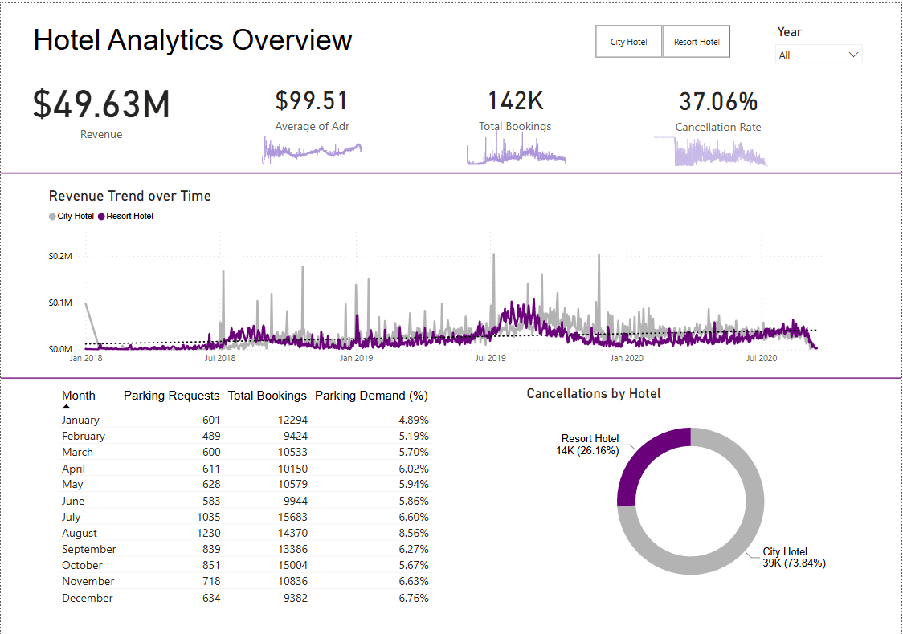

# Hotel Reservation Analysis

## Project Overview
This project analyzes hotel booking data (2015–2020) across two hotel types to uncover patterns in booking behavior, cancellations, revenue, and guest demographics. The analysis was delivered in two forms: a comprehensive written report built with SQL and Python, and a focused, interactive Power BI dashboard built for quick executive-level decision-making.

 **Business Question:**
What drives booking and cancellation behavior across hotel types, and how can that inform pricing, retention, and operational decisions, for both a deep-dive audience and a time-constrained decision-maker?

### Dataset
Hotel reservation data spanning 2015–2020, originally sourced through the FLiT Program is an Excel filewith two sheets. The first sheet provides information and a escription of columns. The second sheet is a table covering 32 columns including reservation details, guest demographics, room type, booking channel, and reservation status. Initial data spanned ~119,000+ rows before cleaning.

## Workflow

### 1. Data Loading & Structuring (SQL)
Year-segmented data was loaded into MySQL and combined into a single unified table, joined with supporting reference tables (meal cost, market segment discount).

### 2. Data Cleaning & Transformation (SQL)
- Removed "Undefined" values in market segment and distribution channel columns.
- Dropped invalid room type codes and bookings with 0 adults and no children/babies (data entry errors).
- Removed outlier entries (e.g. bookings with 9–10 babies, 10 children, or 0 nights stayed).
- Engineered new features: `total_stay`, `revenue`, `season`, and `booking_date` (derived by subtracting lead time from arrival date).

### 3. Exploratory Analysis (SQL)
Answered structured business questions across booking trends, cancellation patterns, revenue by customer/channel, guest demographics, and deposit behavior.

### 4. Visualization & Report (Python)
Used Python (Pandas, Matplotlib, Seaborn) to build all visualizations featured in the detailed written report, covering booking trends, cancellation analysis by lead time and history, guest geography, room and meal preferences, and ADR (average daily rate) by customer type and channel.

### 5. Interactive Dashboard (Power BI)
Built a focused Power BI dashboard answering four key executive questions directly, rather than displaying every metric from the full analysis (see Dashboard Insights below).

## Tools & Technologies
- **MySQL** : data loading, cleaning, transformation, and analysis
- **Python** (Pandas, Matplotlib, Seaborn) : exploratory visualization for the report
- **Power BI** : interactive executive dashboard
- **Jupyter Notebook**

## Report Findings
The full written report (linked below) covers 13 visual analyses in depth. Key findings include:
- **Booking Volume:** City Hotel received significantly more bookings than Resort Hotel overall.
- **Seasonality:** Bookings peak in August (summer) and drop sharply in November across both hotel types.
- **Cancellations:** Overall cancellation rate was 27.93%, with City Hotel cancellations roughly double that of Resort Hotel. Cancellation likelihood rises notably with longer lead times (100+ days) and with any prior cancellation history.
- **Guest Origin:** Portugal and France are the top source markets for guests.
- **Preferences:** Room Type A and Bed & Breakfast meal plans are most commonly booked across both hotels.
- **Revenue:** Transient customers generate the highest ADR by a wide margin; TA/TO (travel agent/tour operator) channels drive the most revenue but at higher acquisition cost than direct bookings.

Full methodology, all 13 visualizations, and complete recommendations are available in the report.

📄 [Read the Full Report](report/Hotel_Analysis_Report.pdf)

## Dashboard Insights
Rather than reproducing the full report, the Power BI dashboard was scoped around four decision-focused questions:

- **How has hotel revenue changed over time?** Revenue has generally trended upward, though City hotels show steady year-over-year growth while Resort hotels show more seasonal fluctuation.
- **Should we increase parking lot capacity?** Parking demand is low overall but spikes in peak months, a flexible parking arrangement is likely more cost-effective than permanent expansion.
- **What broader trends stand out?** Strong seasonality is evident, with higher ADR and bookings aligning with holiday periods.
- **Are cancellations a major issue?** Yes, City hotels cancel at a notably higher rate than Resort hotels, suggesting flexible booking policies or deposit requirements could help reduce no-shows.


*Note: this dashboard reflects a focused subset of the full analysis, scoped for quick executive decision-making rather than comprehensive reporting.*

## Recommendations
1. **Strengthen customer loyalty programs**: over 90% of bookings come from first-time guests; targeted retention offers could improve repeat business.
2. **Optimize distribution channel investment** : reassess marketing spend across channels based on ADR and acquisition cost, favoring higher-margin channels.
3. **Introduce dynamic pricing around high-cancellation periods** : incentivize early, firm bookings during months with historically high cancellation rates.

## Folder Structure
```
├── README.md
├── report/
│   └── Hotel_Analysis_Report.pdf
├── sql/
│   ├── 1_create_and_load_tables.sql
│   ├── 2_data_cleaning_and_transform.sql
│   └── 3_analysis_queries.sql
├── python/
|   ├── hotel_analysis_findings.ipynb
│   └── preprocesing.ipynb
|
├── data/
│   └── (CSV files)
└── visualization/
    ├── booking trend.png
    └── dashboard_screenshot.png
```
